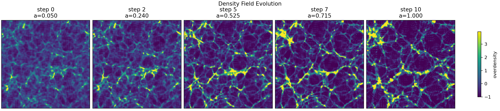
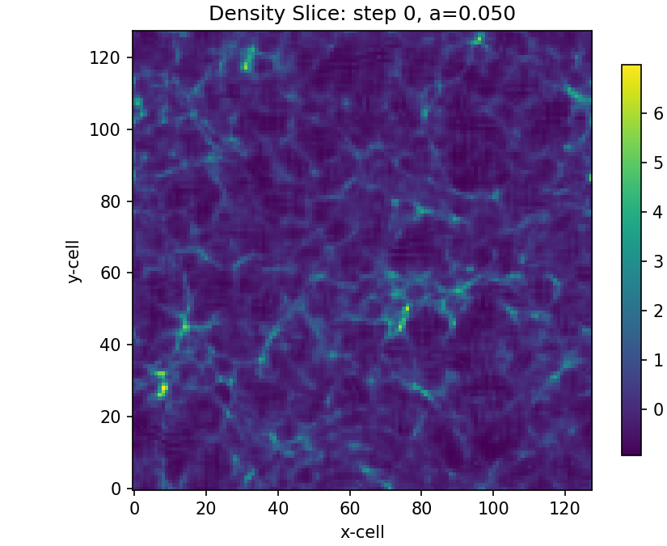
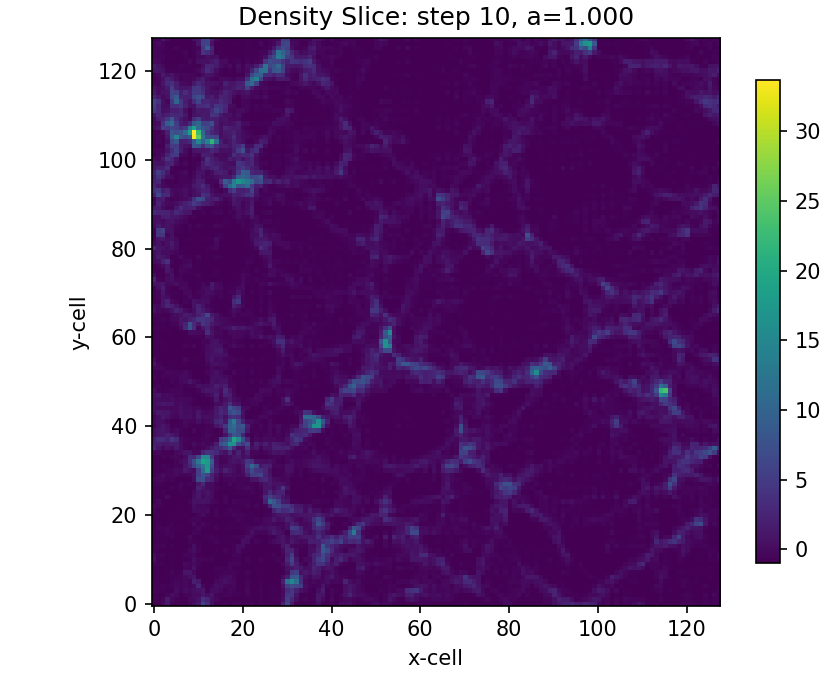
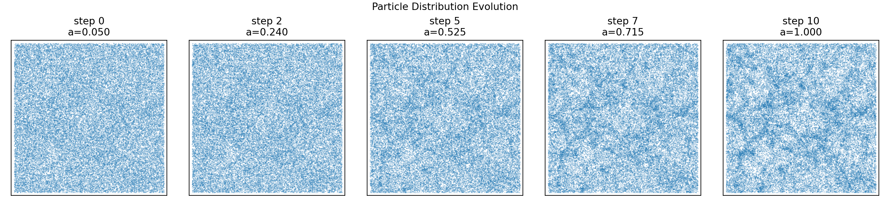
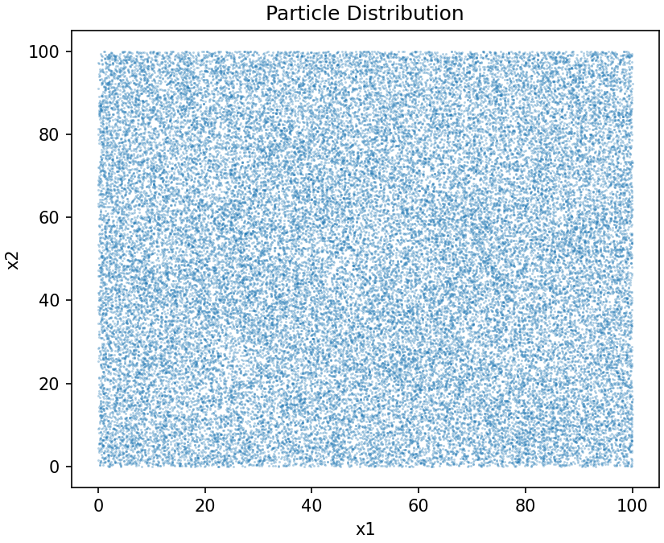
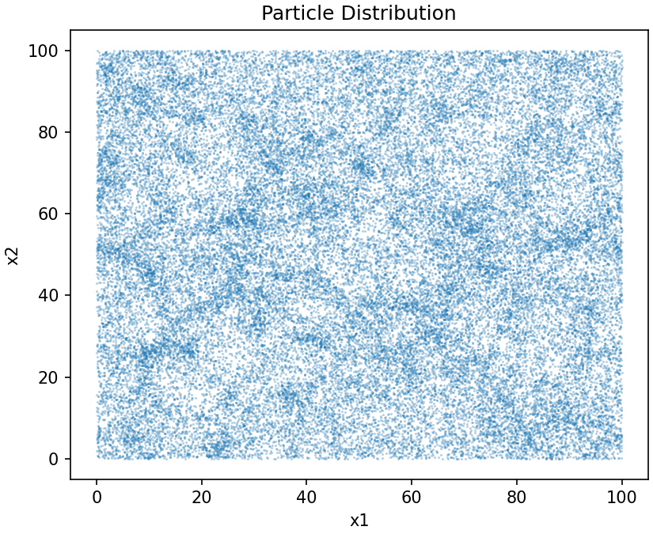
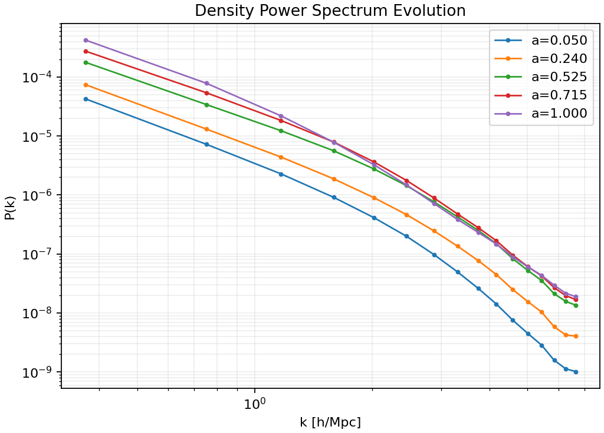
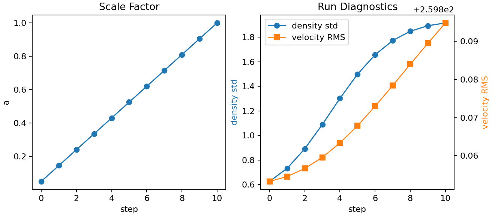

# `lcdm_sim`

Modular Lambda Cold Dark Matter (`LCDM`) particle-mesh simulation toolkit for
learning, experimentation, and reproducible small-box demos.

This repository started as a set of notebook experiments and was later refactored
into a package-backed simulation engine. The implementation follows the standard
PM learning pipeline: generate an initial density field, place particles with the
Zel'dovich approximation, deposit mass with Cloud-In-Cell interpolation, solve
Poisson's equation on a mesh, gather forces back to particles, and evolve the
system with a kick-drift-kick leapfrog integrator.

## Results

The gallery below was generated from the checked-in
`configs/gallery/gallery_128.yaml` run:

```bash
PYTHONPATH=src python -m lcdm_sim.cli run \
  --config configs/gallery/gallery_128.yaml \
  --out-dir outputs/gallery_128 \
  --num-snapshots 5

PYTHONPATH=src python -m lcdm_sim.cli plot \
  --run-dir outputs/gallery_128 \
  --out-dir docs/assets/simulations/gallery-128 \
  --max-snapshots 5 \
  --max-points 50000
```

The showcase run uses `128^3` particles on a `128^3` mesh, from scale factor
`a=0.05` to `a=1.0`, with five saved snapshots, resolving substantially
sharper filamentary structure than the small quickstart run.

### Density Field Growth



The first and final density slices make the growth endpoints easier to inspect
at full figure size:

| Initial density, `a=0.05` | Final density, `a=1.0` |
| --- | --- |
|  |  |

### Particle Distribution Growth

The same five saved stages projected into particle position space:



| Initial particle positions, `a=0.05` | Final particle positions, `a=1.0` |
| --- | --- |
|  |  |

### Quantitative Growth

The binned density power spectrum grows across the saved stages, showing the
increase in clustering strength beyond a visual comparison:



For this `128^3` run, the saved snapshot analysis gives:

| Quantity | Initial, `a=0.05` | Final, `a=1.0` |
| --- | ---: | ---: |
| Density standard deviation | 0.626 | 1.916 |
| Maximum overdensity | 20.481 | 63.867 |
| 99th-percentile overdensity | 2.307 | 8.277 |
| Fraction of cells with `delta > 1` | 6.27% | 13.26% |
| Fraction of cells with `delta > 5` | 0.07% | 2.57% |

Run-history diagnostics retain the stepwise scale factor, density standard
deviation, and velocity RMS:



Additional individual PNGs, the plot manifest, and machine-readable
`snapshot_analysis.json` live under `docs/assets/simulations/gallery-128/`.

## Physics Pipeline

### Cosmology Model

The project assumes a flat late-time LCDM universe, so matter and dark energy
approximately close the density budget:

```text
Omega_m + Omega_Lambda ~= 1
H(a) = H0 * sqrt(Omega_m / a^3 + Omega_Lambda)
```

Radiation is neglected for these educational late-time PM experiments. The code
keeps the central LCDM quantities explicit in `CosmologyConfig`: `h0`,
`omega_m`, `omega_lambda`, `sigma8`, scalar tilt `n_s`, and the starting/final
scale factors.

### Initial Conditions

The initial overdensity field is a Gaussian random field generated in Fourier
space. The power spectrum is shaped as a primordial power law modified by a CDM
transfer function:

```text
P(k) = A * k^n_s * T(k)^2
```

The field is inverse-FFT'd into real space as `delta(x)`, where
`delta = (rho - rho_bar) / rho_bar`. Particles begin on a Lagrangian grid `q`
and are displaced with the Zel'dovich approximation:

```text
x = q + D(a) * Psi(q)
```

Here `D(a)` is the normalized linear growth factor, and the displacement field
comes from the density-derived potential. This bridges the hand-derived notebook
math with the package implementation in `grf.py`, `spectra.py`, and
`zeldovich.py`.

### Particle-Mesh Evolution

Each integration step follows the PM loop:

1. Deposit particle mass onto the mesh with Cloud-In-Cell (`CIC`) weights.
2. Solve the Fourier-space Poisson equation, using the regularized form
   `phi_k = -delta_k / k^2` for nonzero modes.
3. Differentiate the potential to obtain acceleration fields on the grid.
4. Interpolate grid forces back to particle positions with the same CIC shape
   function.
5. Advance particles with the scale-factor kick-drift-kick leapfrog step.

CIC is used in both directions: particle-to-grid for density deposition and
grid-to-particle for force gathering. Periodic wrapping keeps the simulation box
topologically closed, which is the usual toy-model setup for cosmological PM
experiments.

## Codebase Structure

```text
lcdm_sim/
├── configs/
│   ├── gallery/                 # Matched README/benchmark resolution presets
│   └── scaling/                 # Larger exploratory run presets
├── docs/
│   └── assets/simulations/      # Organized versioned result galleries
├── notebooks/                   # Package-backed teaching notebooks
├── src/lcdm_sim/
│   ├── config.py                # Typed config loading
│   ├── types.py                 # Shared dataclasses
│   ├── cosmology.py             # H(a), growth factor/rate
│   ├── spectra.py               # Transfer function + P(k)
│   ├── fft_backend.py           # SciPy / optional pyFFTW FFT wrapper
│   ├── grf.py                   # Gaussian random field generation
│   ├── zeldovich.py             # Zel'dovich initial conditions
│   ├── cic.py                   # CIC density deposition / force gather
│   ├── potential.py             # Poisson solve
│   ├── forces.py                # Acceleration grid helpers
│   ├── integrators.py           # KDK leapfrog in scale factor a
│   ├── simulation.py            # End-to-end orchestration
│   ├── io_hdf5.py               # Snapshot save/load
│   ├── diagnostics.py           # Stats + power spectrum estimates
│   ├── plotting_static.py       # Matplotlib PNG plots
│   ├── plotting_interactive.py  # Optional Plotly plots
│   ├── validation.py            # Validation suite + run-dir validation
│   ├── web_export.py            # Compact browser-facing dataset export
│   └── cli.py                   # CLI entrypoints
└── tests/                       # Phase-by-phase test coverage
```

## Quickstart

### 1. Create an environment

```bash
python -m venv .venv
source .venv/bin/activate
python -m pip install --upgrade pip
```

### 2. Install the package

```bash
python -m pip install -e ".[dev,interactive]"
```

For optional FFT/acceleration experiments:

```bash
python -m pip install -e ".[dev,interactive,performance]"
```

### 3. Run tests

```bash
PYTHONPATH=src pytest -q tests
```

## CLI Usage

Run the lightweight deterministic gallery simulation:

```bash
PYTHONPATH=src python -m lcdm_sim.cli run \
  --config configs/gallery/gallery_32.yaml \
  --out-dir outputs/gallery \
  --num-snapshots 5
```

This writes:

- `outputs/gallery/snapshots/snapshot_*.h5`
- `outputs/gallery/metrics/history.json`
- `outputs/gallery/metrics/run_summary.json`
- `outputs/gallery/metrics/validation_report.json`

Generate PNGs from those snapshots:

```bash
PYTHONPATH=src python -m lcdm_sim.cli plot \
  --run-dir outputs/gallery \
  --out-dir docs/assets/simulations/gallery-32 \
  --max-snapshots 5
```

To reproduce the higher-resolution README gallery, run
`configs/gallery/gallery_128.yaml` and plot into
`docs/assets/simulations/gallery-128/` as
shown in the Results section.

Validate an existing run directory:

```bash
PYTHONPATH=src python -m lcdm_sim.cli validate --run-dir outputs/gallery
```

Export a compact browser-facing dataset for `lcdm_explorer`:

```bash
PYTHONPATH=src python -m lcdm_sim.cli export-web-dataset \
  --run-dir outputs/gallery \
  --out outputs/web-gallery
```

## Notebooks And Notes

The `notebooks/` folder is the maintained notebook sequence. Those notebooks
are package-backed teaching materials that import from `lcdm_sim` instead of
redefining the engine inline.

The README physics walkthrough is a concise synthesis of the project's
handwritten LCDM notes: flat-universe density parameters, critical density,
growth factor normalization, Gaussian random fields, transfer functions,
Zel'dovich displacements, CIC interpolation, Fourier Poisson solves, and
cosmological leapfrog integration.

## Validation

The automated checks cover:

- config and CLI behavior
- Gaussian random fields, spectra, and FFT helpers
- Zel'dovich initial conditions
- CIC density deposition and force interpolation
- Poisson/acceleration grids
- KDK integration and end-to-end simulation orchestration
- HDF5 snapshot I/O
- static and optional interactive plotting
- run-directory validation reports

Expected verification command:

```bash
PYTHONPATH=src pytest -q tests
```

## Lineage

This project was inspired by
[`grkooij/Cosmological-Particle-Mesh-Simulation`](https://github.com/grkooij/Cosmological-Particle-Mesh-Simulation),
but it has diverged into a package-first educational implementation with typed
configs, test coverage, HDF5 snapshots, CLI integration, validation reports, and
reproducible generated figures.
